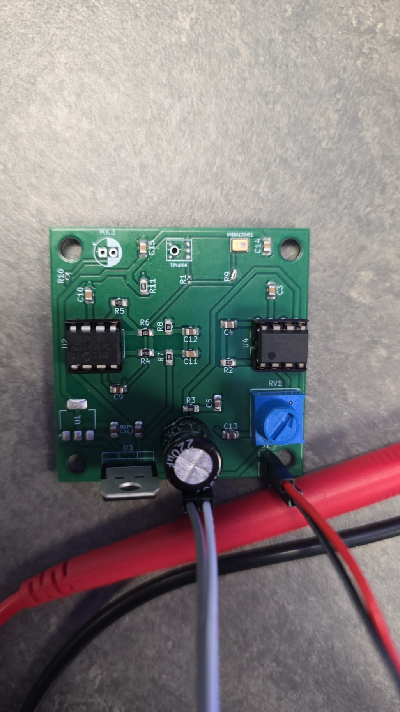

# Multi-Microphone Audio Amplifier

**Compact microphone preamplifier and speaker-amplifier PCB supporting analog MEMS and electret microphone options.**

This project combines a microphone front end, an **MCP6281 preamplifier**, adjustable signal level, and an **LM386 speaker amplifier** on a single 50 × 50 mm PCB. It was developed as a reusable audio front end for electronics experiments, communication projects, and compact standalone audio systems.

The repository contains the editable KiCad design and production-ready V1.1 Gerber files. A physical prototype has also been assembled.

<!-- Add your photo as Media/circuit-photo.jpg, then remove this comment marker:

-->
[Assembled microphone amplifier](Media/circuit-photo.jpeg

> **Status:** PCB designed and manufactured; prototype photo available  
> **Input supply:** Regulated 5 V  
> **Audio stages:** MCP6281 preamplifier + LM386 speaker amplifier  
> **Microphone options:** INMP411, IM68A130V01, or KPCM-G60H50P/external electret input  
> **PCB:** Two-layer, 50 × 50 mm, 1.6 mm thick

## Why I Built This

Testing analog microphones often requires several separate modules: a microphone breakout, low-level preamplifier, volume control, speaker amplifier, voltage regulator, and extensive wiring. That arrangement is useful for early breadboard testing, but it becomes bulky and noise-prone in a finished experiment.

This board integrates those functions into one compact platform. It also provides several microphone footprints so different analog microphone technologies can be compared using the same downstream amplification chain.

## Signal Path


The selected microphone produces the shared `Mic-out` signal. The MCP6281 stage raises the low-level microphone signal, after which the 10 kΩ potentiometer sets the level presented to the LM386. The LM386 then drives an external speaker through the output-coupling network.

## Features

- Three microphone-source options on one PCB
- Low-voltage MCP6281 analog preamplifier
- LM386 power amplifier for a small external speaker
- Adjustable 10 kΩ signal-level control
- Onboard 5 V to 3.3 V regulation for microphone circuitry
- AC-coupled audio stages with local supply decoupling
- LM386 output network with a 250 µF coupling capacitor
- Mostly hand-solderable 0805 passives and DIP amplifier packages
- Two-layer 50 × 50 mm PCB
- Four 4 mm mounting holes
- Editable KiCad 10 source files
- Manufacturing-ready V1.1 Gerber and drill files

## Microphone Options

The PCB includes footprints for multiple analog microphone sources:

| Reference | Device | Type |
|---|---|---|
| `INMP1` | INMP411 | Analog MEMS microphone |
| `IM68A130V1` | IM68A130V01 | Analog MEMS microphone |
| `MK3` / `J1` | KPCM-G60H50P or external microphone | Through-hole/electret option |

The zero-ohm routing links in the design allow the desired source to feed the common microphone-output net. Check the schematic and populate only the intended microphone path before powering the board.

## Main Hardware

| Component | Function |
|---|---|
| MCP6281 | Microphone preamplifier |
| LM386 | Speaker power amplifier |
| 10 kΩ potentiometer | Audio-level adjustment |
| LD1117-3.3 regulators | 3.3 V supply generation |
| 250 µF capacitor | Speaker-output coupling |
| 0805 resistors and capacitors | Biasing, gain setting, filtering, and decoupling |
| 2-pin speaker header | External speaker connection |

## Power

The analog amplifier circuitry is designed around a **regulated 5 V supply**. Onboard LD1117-3.3 regulator stages generate the 3.3 V rails required by the microphone circuitry.

Use a clean, current-limited 5 V source during initial testing. Confirm supply polarity and check the 3.3 V rails before fitting sensitive microphone components.

## PCB

| Property | Value |
|---|---:|
| Dimensions | 50 × 50 mm |
| Copper layers | 2 |
| Thickness | 1.6 mm |
| Copper weight | 35 µm per layer in the stored stack-up |
| Mounting holes | 4 × 4 mm |
| Design tool | KiCad 10 |
| Board revision | V1.1 |

## Connecting and Testing

1. Inspect the assembled board for solder bridges and incorrect component orientation.
2. Select and populate the intended microphone path.
3. Connect a current-limited regulated 5 V supply.
4. Verify the 3.3 V rails before installing or testing the microphone.
5. Connect a suitable small speaker to the speaker-output header.
6. Start with the level potentiometer turned down.
7. Apply an acoustic input and increase the level gradually while checking for clipping, oscillation, or overheating.

The LM386 can draw significant transient current when driving a low-impedance speaker. Keep power leads short and use a supply capable of handling the load without excessive voltage drop.

## Repository Structure

```text
Multi-Microphone-Audio-Amplifier/
├── README.md
├── LICENSE
├── .gitignore
├── GITHUB_SETUP.md
├── Hardware/
│   ├── KiCad/
│   │   ├── Microphone amp.kicad_pro
│   │   ├── Microphone amp.kicad_sch
│   │   └── Microphone amp.kicad_pcb
│   └── Gerbers/
│       ├── GerberV1.1.zip
│       └── manufacturing files
└── Media/
    ├── README.md
    └── circuit-photo.jpg
```

## Manufacturing

The latest manufacturing package is:

[`Hardware/Gerbers/GerberV1.1.zip`](Hardware/Gerbers/GerberV1.1.zip)

Before ordering, inspect the Gerbers in the board manufacturer's viewer and confirm:

- board outline and 50 × 50 mm dimensions
- drill and mounting-hole sizes
- copper, mask, and silkscreen alignment
- selected PCB thickness and copper weight
- component availability and footprints

## Known Limitations

- Only one microphone path should be treated as the active source unless the routing and bias networks are intentionally modified.
- The board does not include automatic gain control.
- The LM386 output is intended for small speakers, not high-power audio loads.
- Analog performance depends strongly on microphone selection, assembly, grounding, speaker impedance, and supply quality.
- This is an experimental electronics project and has not been certified as a commercial audio product.

## Possible Future Improvements

- Measured frequency-response and noise plots
- Oscilloscope captures for each amplifier stage
- Clearly labelled external power connector
- Input-source selection using jumpers or a switch
- Reverse-polarity and over-current protection
- Updated revision with a smaller board outline
- Audio demonstration video

## License

This project is available for personal, educational, academic-research, and other non-commercial use under the terms in [LICENSE](LICENSE). Commercial use requires separate written permission.

## Author

Designed by **Taylan ARSLAN**.

